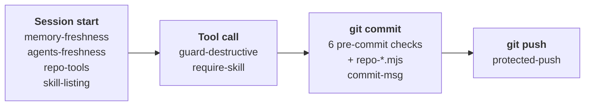

<div align="center">

<h1>Agent Workflow Kit</h1>

<p><strong>Rules, hooks and skills for repositories where Claude Code does the work.</strong></p>

<p>
  <a href="#quick-start">Quick start</a> ·
  <a href="#what-it-catches">What it catches</a> ·
  <a href="#skills">Skills</a> ·
  <a href="#configuration">Configuration</a> ·
  <a href="SETUP.md">Setup runbook</a> ·
  <a href="CHANGELOG.md">Release notes</a>
</p>

<p>
  <a href="CHANGELOG.md"></a>
  
  <a href="https://docs.anthropic.com/en/docs/claude-code"></a>
  <a href="LICENSE"></a>
</p>

</div>

> [!NOTE]
> **New in 0.2:** eight skills (five workflow skills joined the two Korean writing
> skills, and `report-figures` arrived in 0.2.6), repos without GitHub issues
> (`issue_first: false`), and an install that keeps the rule files you already have.
> See the [release notes](CHANGELOG.md).

Agent Workflow Kit gives a repository a short rule kernel that Claude Code reads on every
request, hooks that catch the moment a rule was skipped, and skills that carry the longer
procedures. This repo is the single source: each target repo gets git-tracked copies
through `install.mjs`, so a fix made here reaches every repo on its next update instead
of drifting per copy.

## How it works

| Rules | Backstops | Skills |
| :--- | :--- | :--- |
| `CLAUDE.md` + `AGENTS.md` kernel, gates first, about 50 lines | Git hooks at commit and push | Eight skills that load when the task matches |
| Rulebook under `docs/agent-workflow/` | Claude Code hooks before a tool call and at session start | Scripts behind them, so a procedure is run, not recalled |

The rules say what to do. The hooks are backstops, not the rule source: tripping one
means the workflow was already skipped, so fix the order, not just the failure. Each
hook fires at a fixed point in a session:



## Is it for you?

- Claude Code edits, commits and opens pull requests in your repository, often under
  `bypassPermissions`, where the only confirmation left is one a hook forces.
- Several repos or teammates should follow the same rules, and a fix should reach all
  of them from one place.
- Work runs in parallel worktrees, and each branch should stay tied to its issue and
  its management document.
- Your team writes Korean reports or UI text and does not want them to read like
  translations. The Korean skills and their gate act only on Korean text.

## What it catches

| Without the kit | With the kit |
| --- | --- |
| An agent under `bypassPermissions` deletes a directory or force-pushes. A git hook would only notice at the next commit. | `guard-destructive` runs before the tool call and asks first: recursive deletes, force push, hard reset, `git clean`, `DROP`/`TRUNCATE`, publish commands. |
| `AGENTS.md` grows by appending, and a pointer to a branch merged months ago keeps steering the agent. | `context-budget` (pre-commit) and `agents-freshness` (session start) flag the size and the stale pointer. |
| Session memory still says a branch is "unpushed" long after it merged. | `memory-freshness` checks each such claim against git at session start and quotes the line. |
| After a context compaction, a skill that was never invoked disappears from the agent's view. | `skill-listing` hands the listing back after the compaction; `require-skill` blocks a Korean edit until the writing skill is loaded. |
| Merged branches and worktrees pile up, and a squash merge hides them from `git branch --merged`. | `post-pr-cleanup` classifies every worktree and branch and, after you confirm, removes only what provably landed. |
| A new management doc lands without its registry row; a new note never gets indexed. | `registry-row` and `notes-index` block the commit until the index line is in. |
| A Korean report is written in English and translated, and reads like machine output. | `ko-writing` writes from the facts in Korean, with a mechanical check and a cold reader per section. |

## Quick start

You need git, Node 20 or newer, and
[Claude Code](https://docs.anthropic.com/en/docs/claude-code); the agent installs Node
for you if it is missing. `gh` is needed for the issue workflow. Python 3 runs the
scripts of `ko-writing`, `report-figures` and `experiment-gate`, and `ui-evidence`
drives a local Chrome.

### Install into your repo (owner, once per repo)

Clone the kit next to your repo and start Claude Code in your repo:

```sh
git clone https://github.com/lhk0721/agent-workflow-kit.git
cd <your-repo>
claude
```

Then tell the agent:

```text
Install the agent workflow kit from ../agent-workflow-kit
```

The agent follows [`SETUP.md`](SETUP.md): it checks Node, asks for your options
(profile, protected branches, team language, issue-first or not, worktree location,
base branch, notes directory, doc pairs, repo tools), runs the installer, verifies with
doctor, and commits after your approval.

A repo that already has richer rule files keeps them: an existing
`docs/agent-workflow/<file>.md` without the kit marker is left untouched and reported,
so you can compare it with the kit's copy at your own pace.

<details>
<summary><strong>Install without the agent</strong></summary>

From your repo root:

```sh
node ../agent-workflow-kit/install.mjs
node .githooks/checks/doctor.mjs
```

Write your answers into `agent-system.yaml`
([the options](SETUP.md#2-interview-the-user-before-writing-anything)) and commit. The
install commit lands on a protected branch by design, so it uses the one legitimate
escape hatch:

```sh
AGENT_KIT_SKIP=1 git commit -m "chore: install agent-workflow-kit v<version>"
```

</details>

### Join a repo that already has the kit (teammate)

```sh
git clone <team-repo-url>
cd <team-repo>
claude
```

Then tell the agent:

```text
run onboarding
```

The agent follows `docs/agent-workflow/onboarding.md`: it checks or installs Node and
`gh`, enables the hooks for your clone (`core.hooksPath` is per clone), asks which
language and style you want replies in, runs doctor, and walks you through the two
gates.

First time with Claude Code? Install it first from
https://docs.anthropic.com/en/docs/claude-code (`npm install -g @anthropic-ai/claude-code`,
or the native installer on that page if you don't have Node yet; the agent installs Node
for the hooks during onboarding either way).

## What a repo gets

| Path | What it is |
| --- | --- |
| `CLAUDE.md`, `AGENTS.md` | The kernel: gates first, about 50 lines, plus repo-owned slots (Recent Active Context, Environment, Canon, Domain Rules, Repo Tools) |
| `docs/agent-workflow/` | The rulebook: git, documentation, verification, context maintenance, templates, onboarding, skills |
| `.githooks/` | Commit and push backstops in Node: eight checks over three hooks, plus your own `checks/repo-*.mjs` |
| `.claude/hooks/` | Claude Code hooks: two before a tool call, four at session start |
| `.claude/skills/` | Eight skills |
| `agent-system.yaml` | Repo settings ([Configuration](#configuration)) |
| `agent-system.lock.json` | Version pin, install manifest, and a hash per system-owned file so doctor can spot in-place edits |

### Git hooks

Enabled per clone through `core.hooksPath`.

| Hook | Check | Effect |
| --- | --- | --- |
| pre-commit | `management-doc` | Blocks direct commits on protected branches. On an issue branch, requires its own management doc, refuses another issue's doc, and blocks while another branch for the same issue is ahead |
| | `registry-row` | Blocks a new management doc without its Master Registry row |
| | `notes-index` | Blocks a new note under `notes_dir` that `<notes_dir>/README.md` does not link |
| | `doc-pairs` | Blocks, or warns per pair, when only one doc of a declared pair changes |
| | `context-budget` | Warns on `AGENTS.md` size and stale Recent Active Context pointers |
| | `encoding` | Warns on a `.ps1` without a UTF-8 BOM and on CRLF in `.sh`, `.dts`, `.service` and `.rules` files |
| | `repo-*.mjs` | Your repo's own checks; the kit never ships or touches them |
| commit-msg | `commit-msg` | Requires `<type>: <summary>`, plus `(#<issue>)` on issue branches |
| pre-push | `protected-push` | Blocks pushes to protected branches (except the `solo` profile), deleting them, and force pushes |

### Claude Code hooks

Registered in `.claude/settings.json`; the installer replaces only its own entries.

| Event | Hook | Effect |
| --- | --- | --- |
| PreToolUse (Bash, PowerShell) | `guard-destructive` | Deny, ask and warn tiers for commands that are hard to undo. `ask` prompts even under `bypassPermissions`. Extend it with `.claude/guard.json` |
| PreToolUse (Write, Edit, …) | `require-skill` | Denies an edit that carries Korean text until the matching skill is loaded (`.claude/require-skill.json`) |
| SessionStart | `memory-freshness` | Checks "unpushed / uncommitted" claims in session memory against git |
| SessionStart | `agents-freshness` | Flags `AGENTS.md` pointers whose branch is gone, landed or stale, even when no commit touches the file |
| SessionStart | `repo-tools` | Announces a repo tool from `agent-system.yaml: tools` only while its artifact exists in this clone |
| SessionStart (after compaction) | `skill-listing` | Puts the skill listing back; Claude Code does not re-send it after a compaction |

## Skills

Installed to `.claude/skills/`; each loads itself when the task matches. Details and
config files: [`rulebook/skills.md`](rulebook/skills.md).

| Skill | Use it when |
| --- | --- |
| [`issue-start`](skills/issue-start/SKILL.md) | Work is about to start that no open issue tracks. One script registers the issue, creates the branch and worktree from the remote base, and seeds the management doc, registry row and `AGENTS.md` pointer. |
| [`post-pr-cleanup`](skills/post-pr-cleanup/SKILL.md) | A pull request merged. Classifies every worktree and branch and, after you confirm, removes only what provably landed. |
| [`session-handoff`](skills/session-handoff/SKILL.md) | A session may end with work in flight. Writes the note a fresh session needs: what runs where, what is confirmed, the next steps in order. |
| [`ui-evidence`](skills/ui-evidence/SKILL.md) | A UI change needs proof. Screenshots at desktop and 390px phone width over headless Chrome, with an overflow verdict and console errors, as a Markdown table for the PR. |
| [`experiment-gate`](skills/experiment-gate/SKILL.md) | A candidate (model, prompt, parameter) is compared with a baseline. Gate document first, paired bootstrap on the same items, a fixed win threshold. |
| [`report-figures`](skills/report-figures/SKILL.md) | Figures or tables go into a report or PDF. One claim per figure, gray charts with one accent, a figure sheet with copy buttons. |
| [`ko-writing`](skills/ko-writing/SKILL.md) | Korean prose: reports, docs, READMEs, release notes. Written from the facts in Korean, never translated, then checked. |
| [`ko-ui-text`](skills/ko-ui-text/SKILL.md) | Korean screen strings: buttons, labels, errors, empty states. |

## Configuration

`agent-system.yaml` is repo-owned; update never touches it. A key you leave out falls
back to its default.

| Key | Default | What it sets |
| --- | --- | --- |
| `profile` | `shared` | `solo` (single remote) · `shared` (team, branch + PR) · `external` (forks) |
| `protected_branches` | `[main]` | Branches that never take direct commits or pushes |
| `team_language` | `en` | Language of commit, issue and PR titles and the README |
| `issue_types` | `feature`, `fix`, `docs`, `chore`, `refactor`, `perf` | The `<type>` in branch names |
| `umbrella_issues` | `per-member` | One umbrella issue per member's workstream, or `off` |
| `issue_first` | `true` | `false` drops GitHub issues ([below](#repos-without-issues)) |
| `branch_pattern` | none | Branch names when `issue_first: false`, e.g. `<member>/<desc>` |
| `issues_root` | `docs/issues` | Where management docs live |
| `worktree_root` | `sibling` | `sibling` = `../<repo>-<issue>` · `claude` = `.claude/worktrees/<issue>-<short>` |
| `base_branch` | `origin/HEAD` | The ref branches start from and PRs target |
| `notes_dir` | none | Working-notes tree; every new note must be linked from its `README.md` |
| `doc_pairs` | none | Docs that change together: `a <-> b` blocks, `a <-> b \| warn \| why` reminds |
| `tools` | none | Repo tools as `<tool doc> \| <artifact>`, announced only while the artifact exists |

Two more repo-owned files tune the Claude Code hooks: `.claude/guard.json` (extra deny,
ask and warn patterns, guarded paths, and `askTier`) and `.claude/require-skill.json`
(which skill an edit under which path needs).

### Repos without issues

Not every repo runs on GitHub issues — a solo research repo, a course project, a repo
whose tracker lives elsewhere. Set `issue_first: false` in `agent-system.yaml` and give
`branch_pattern` (e.g. `<member>/<desc>`): the hooks stop asking for an issue suffix and
a management document, branches follow the pattern, and the record of each work unit is
one section in a working note under `notes_dir`. Everything else — worktrees, the review
gate before every commit, protected branches, the push rule — stays on.

## Update / Uninstall

- **Update**: pull the kit, then from your repo root rerun
  `node ../agent-workflow-kit/install.mjs`. It overwrites system-owned files only; your
  config, slots and logs are never touched. Read the [release notes](CHANGELOG.md)
  first — **Upgrading** lists anything to do by hand. Review the diff, commit.
- **Uninstall**: `node ../agent-workflow-kit/uninstall.mjs` replays the install manifest:
  it removes system files and the `AGENTS.md` kernel block, unsets `core.hooksPath`, and
  keeps all repo-owned files. `core.hooksPath` is per clone — unset it in other clones
  too.

### Ownership (what update touches)

| Scope | Files | Update touches? |
| --- | --- | --- |
| System-owned | `CLAUDE.md` (only when it starts with the kit marker comment), AGENTS.md kernel block, `docs/agent-workflow/*.md` that carry the kit marker, `.githooks/*` except `checks/repo-*.mjs`, `.claude/hooks/*`, the eight kit skills under `.claude/skills/` | Yes — overwritten |
| Repo-owned | `agent-system.yaml`, AGENTS.md slots, `docs/issues/**` (or `issues_root`), `<notes_dir>/**`, `docs/agent-workflow/repo-*.md`, `docs/agent-workflow/tools/*`, any `docs/agent-workflow/*.md` without the kit marker (adopt mode), `.githooks/checks/repo-*.mjs`, `.claude/guard.json`, `.claude/require-skill.json`, other `.claude/skills/*`, `ko-writing.config.md`, `ui-text.config.md`, `ui-text.glossary.md` | Never |
| Personal | reply language & style in `~/.claude/CLAUDE.md`, session memory | Outside the system |

## What it is not

- **Not branch protection.** The server setting is the source of truth; `pre-push` is
  its local backstop. Set GitHub branch protection to match `protected_branches`.
- **Not a per-repo fork.** Target repos get git-tracked copies that update overwrites.
  Fix the kit, then update; doctor reports a system-owned file edited in place.
- **Not an agent runtime.** It runs inside Claude Code's own hooks and skills and adds
  no server, daemon or model.

## Documentation

The rulebook installs to `docs/agent-workflow/` in a target repo; here it lives under
`rulebook/`.

| Need | Start here |
| --- | --- |
| Install the kit (agent runbook) | [`SETUP.md`](SETUP.md) |
| Set up a new teammate | [`rulebook/onboarding.md`](rulebook/onboarding.md) |
| Branches, worktrees, commits, PRs, cleanup | [`rulebook/git-rules.md`](rulebook/git-rules.md) |
| Management docs and working notes | [`rulebook/documentation-rules.md`](rulebook/documentation-rules.md) |
| Verification, measurement, background runs | [`rulebook/verification-rules.md`](rulebook/verification-rules.md) |
| `AGENTS.md` budget and the hook layers | [`rulebook/context-maintenance.md`](rulebook/context-maintenance.md) |
| Skills and their config files | [`rulebook/skills.md`](rulebook/skills.md) |
| Templates | [`rulebook/templates.md`](rulebook/templates.md) |
| What changed in each version | [`CHANGELOG.md`](CHANGELOG.md) |

## Working on the kit

Run every test suite from the kit root:

```sh
for t in claude-hooks/*.test.mjs skills/*.test.mjs skills/*/scripts/*.test.mjs; do node "$t"; done
for t in skills/*/scripts/*_test.py; do python "$t"; done
```

On Windows, set `PYTHONUTF8=1` first; without it the `experiment-gate` CLI test fails on
a cp949 console.

A change that reaches target repos bumps [`VERSION`](VERSION) and adds its entry to
[`CHANGELOG.md`](CHANGELOG.md) in the same pull request.

## License

[MIT](LICENSE).

---

Maintained by [@lhk0721](https://github.com/lhk0721).
